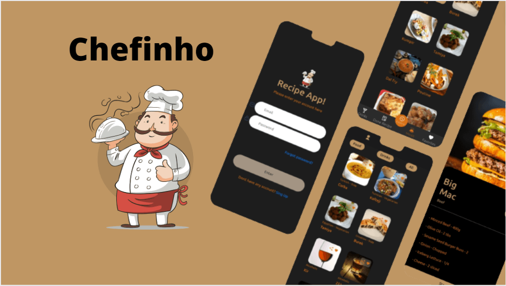

<h1 align="center"> 🧂🥗🥣 Recipe APP 🍹🍸📖</h1>

<div align="center" style=''>



</div>

## 📓 Sobre

Este projeto foi desenvolvido com intuito de desafiar nossas habilidades como
desenvolvedores, trabalhando em equipe.

<details>
  <summary>Sobre o desenvolvimento</summary>
  <br />
  <p>
    Para o desenvolvimento do projeto, recebemos um formulário com informações de como o projeto deveria funcionar a partir da visão do cliente e a partir de ai tendo em mente o que deveríamos ou não fazer dividimos quem ficaria responsável por qual parte e que caso necessário ajudaríamos no desenvolvimento daquela parte especifica.
    Utilizamos o framework ReactJS + context api, pois o projeto era simples e esse gerenciamento de estado pareceu mais pratico para se trabalhar com as informações da aplicação e entregar no tempo demandado pelo cliente.
    Tínhamos 9 dias para apresentar o projeto e a partir dai dividimos as tarefas e começamos a desenvolver o projeto.
  </p>
  <br />
</details>
<br />

  ### Habilidades utilizadas durante o desenvolvimento 💻

<details>
  <summary> 🦾 Habilidades</summary>
  <br />

  * Desenvolvimento de aplicações React
  * Desenvolvimento de aplicações com React Context API
  * Desenvolvimento de aplicações mobile first
  * Consumo de API
  * Criação de design
  * Trabalho em equipe
  * Comunicação
  * Planejamento
  * Organização
  * Autonomia
  * Responsabilidade
  * Criatividade
  * Pair programming
  * Metodologias ágeis (Scrum e Kanban)

  <br />
</details>

<details>
  <summary> 🖥️ Tecnologias</summary>
  <br />

  * React.js
    * Components Funcional
    * Context API
    * React Router
  * HTML5
  * CSS3
  * JavaScript
  * Styled-components
  * Git
  * GitHub-pages
  * Vercel

  <br />
</details>

<details>
  <summary> 🖥️ Implementações futuras 🖥️</summary>
  <br />

  * Front-end
    * Aplicar atomic design
    * Criar um design responsivo para web
    * Aplicar mais testes
  * Back-end
    * Criar uma api para armazenar os dados de usuários
    * Criar uma api para armazenar os dados de receitas
    * Criar testes de integração
    * Criar testes E2E

  <br />
</details>

  <br />

### 🤝 Colaboradores 💻

<br />
<table>
  <tr>
    <td align="center">
      <a href="https://github.com/EduMLAlmeida">
        <br>
        <sub>
          <b>Eduardo Almeida</b>
        </sub>
      </a>
    </td>
    <td align="center">
      <a href="https://github.com/erik-efl">
        <br>
        <sub>
          <b>Erik Lima</b>
        </sub>
      </a>
    </td>
    <td align="https://github.com/GuilhermeRX">
        <br>
        <sub>
          <b>Luiz Guilherme</b>
        </sub>
      </a>
    </td>
  </tr>
</table>

<br />

##

## ⚙️ Status do Projeto 🛠️

  ```js
    let projeto {
      "status": "Em desenvolvimento"
    }
  ```
##

### ©️ Aviso de direitos autorais

</br>

Esse projeto foi desenvolvido para propósitos de aprendizagem e divulgação de meus projetos, todo o código e documentação são da autoria de [Erik-EFL](https://github.com/Erik-EFL) e os direitos pertencem exclusivamente a [Erik-EFL](https://github.com/Erik-EFL). É permitido baixar ou clonar o repositório para fins de estudo. Contudo, não é permitido publicar cópias totais ou parciais. Este aviso não cobre bibliotecas, dependências ou marcas, estas estão sujeitas a suas respectivas licenças.
